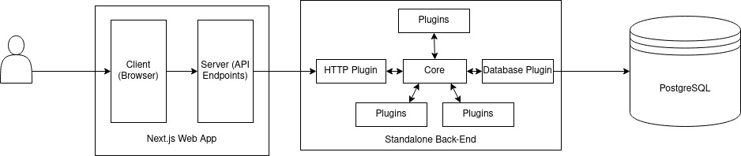
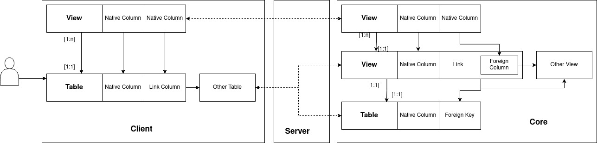

# High-Level Overview of the Application's Structure

Congratulations, and welcome to the illustrious `dekanat-app` project.
You have been selected for Heidelberg's finest software development
task force, the top-secret spec-ops team known as the Ungeprüfte Hilfskräfte.
In order to help you get your bearings in this rather complex system, here
is an overview of how the app works.

## Technologies, Components
The app consists of a Next.js web-application that the user accesses through
the browser, a PostgreSQL database, and a standalone back-end written in
node.js to mediate between the two. All node.js code is written in TypeScript.


## Database
The database is a PostgreSQL server. Currently, it runs in a Docker container
to facilitate development, we have not yet decided whether to maintain
this in production.

## Back-End: The Core
The back-end centers around an event bus system named IntuTable, whose
main module is called the "core". The core loads a given list of plugins
on start-up, each of which listens on a _channel_ and exposes certain
_methods_. These can be called by passing a JSON object to the
core's `request` method.
Example:
```typescript
import * as db from "@intutable/database/dist/requests"

// note: Do not construct requests manually like this...
const rows = await core.events.request({
    channel: "database",
    method: "select",
    table: "users",
    columns: ["email", "password"]
})
// ... instead use the request constructor that the database
// plugin exports:
const rows = await core.events.request(
    db.select("users", { columns: ["email", "password"] })
)
```
In addition to this basic remote procedure call (RPC) functionality, the
core supports events called _notifications_. A request is directed _at_
one plugin, a notification comes _from_ a plugin. Only one plugin may
listen for requests on a given channel, but all plugins can listen for
all notifications. A request must have a response, a notification need not.
This enables plugins to interact very closely with each other while
remaining separated, independent functional units.
Example:
```typescript
// database plugin:
core.events.listenForRequests("database")
    .on("deleteTable", (request) => {
        deleteTable(request)
        core.events.notify({
            channel: "database",
            method: "tableDeleted",
            name: request.name
        })
    })

// metadata plugin:
core.events.listenForNotifications("database")
    .on("tableDeleted", (request) => deleteTableMetadata(request))

// ==> database plugin can control higher-level metadata plugin
// without being dependent on it in any way
```
An overview of the most important plugins:  
    - `database`: Wraps the [`knex`](https://knexjs.org/) library for
    basic, unconstrained database access.  
    - `project-management`: Allows creating and editing SQL tables with
    metadata and assigning of these tables to projects and users.  
    - `lazy-views`: Built on `project-management`, provides SQL-like views
    that can contain links to other tables/views as well as filtering, sorting,
    and grouping.  
    - `http`: Turns the core into a simple web server, allowing other processes
    to send requests and notifications via HTTP.  
    - `user-authentication`: Restricts access to the `http` plugin with a
    standard HTTP authentication scheme.  

## `dekanat-app`: Project Structure
Looking in the `package.json`, you will find five workspaces:  
    - `database`: The Dockered PG database.  
    - `shared`: Some definitions and configs shared across the other
    workspaces.  
    - `dekanat-app-plugin`: A Core plugin that allows the GUI to make
    highly specific, privileged requests, such as setting up example
    data for dev mode or handling its own table abstraction (which
    we will see in the next section)  
    - `backend`: The script that starts the Core process.  
    - `gui`: The Next.js application that serves as a front-end. It is a
    full web application; user inputs are serviced entirely through its own
    API endpoints. These, however, get their data from the `core` back-end.  
  
To avoid confusion with the terms "back-end" and "front-end", we will use
the terms "client" and "server" for the parts of the Next.js app, and
refer to the standalone back-end as "core".



## `dekanat-app`: How it Works
### Tables and Views
If you haven't already, this is probably a good time to launch the app and
try it out (see `/README.md` for a basic intro)

After logging in, you should be redirected to the project page and see one
project named "Fakultät MathInf". Click on it to see its table list, then
select "Personen". In the middle of the screen is the table itself.
You can click on a cell and start typing to edit it. The toolbar has
"add column", "add row", "add link", an export button (download icon) and
a "detail view" button. You can experiment with these, they are fairly
self-explanatory. The "add link" button allows you to add a link to another
table. To see an example of this, check the "Rollen" table. If you
click on a cell in the "Nachname" column, you can pick a different record
to link with. If you do, the corresponding "Vorname" cell will change, too.

To accomplish the linking functionality, what the user sees as a table
is actually a view. The app manages the view and the underlying table,
which contains the actual data, as a unit. This abstraction happens between
the client and server in the Next.js app. What the user sees as views
is implemented as a set of views on top of the "table" view:



### GUI: Workspace Structure
The GUI workspace is probably larger than all other code of the
app combined. To help you get into it nonetheless, here is an overview of
the most important source directories and files:  
    - `pages`: The pages that the user can navigate around.  
    - `pages/api`: API endpoints, i.e. routes that the GUI can request data
    from. All database-relevant actions, such as creating, loading, and
    editing tables, are performed by addressing one of these routes.  
    - `api`: Library of utilities for communication with API routes and with
    the Core.  
    - `components`: A library of React (display) components for the front-end.
    To get an idea of which components are used how, it is suggested you
    look into the table page at
    `pages/project/[projectId]/table/[tableId].tsx`.
    - `hooks`: A library of [hooks](https://reactjs.org/docs/hooks-intro.html):
    components that are not displayed and only capture app logic or state.  
